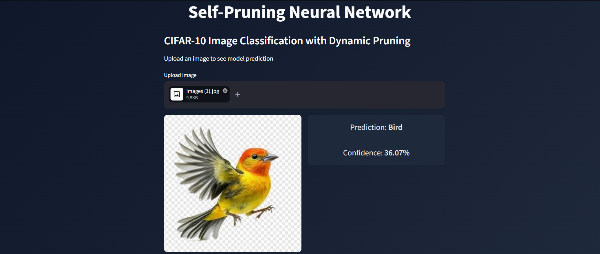

# 🧠 Self-Pruning Neural Network

## CIFAR-10 Image Classification with Dynamic Pruning

  

---

# 🚀 Overview

This project implements a self-pruning neural network that dynamically learns to remove unnecessary weights during training using L1-based sparsity regularization.

Unlike traditional pruning (post-training), this approach allows the model to:

- Learn which connections are important
- Suppress irrelevant weights during training
- Achieve a balance between accuracy and sparsity

---

# 🎯 Problem Statement

Deep neural networks often:

- Contain redundant parameters  
- Consume high memory  
- Have unnecessary computational cost  

Goal:

Build a model that:
- Maintains performance  
- Automatically reduces its own complexity  

---

# 🧠 Core Idea

Effective Weight = Weight × Gate

- Gate ∈ [0,1]
- L1 regularization pushes gates → 0

This results in automatic pruning.

---

# 📊 Dataset

- Dataset: CIFAR-10
- Classes: 10
- Images: 32×32 RGB

Loaded using torchvision.

---

# 🏗️ Project Structure

self-pruning-neural-network-cifar10/
│
├── models/
├── training/
├── api/
├── ui/
├── utils/
├── config/
├── outputs/
├── assets/
├── main.py
├── requirements.txt
└── README.md

---

# ⚙️ How to Run

## 1. Train Model

python main.py

## 2. Run API

uvicorn api.app:app --reload

## 3. Run UI

streamlit run ui/app.py

---

# 📊 Results

| Lambda | Accuracy | Sparsity |
|--------|----------|----------|
| 0.001 | ~56% | Low |
| 0.01  | ~57% | Medium |
| 0.1   | ~57% | High |

---

# 🧠 Key Insights

- Increasing λ increases sparsity but reduces accuracy
- Most pruning happens gradually during training
- High λ leads to over-pruning

---

# 🚀 Technologies Used

- PyTorch
- FastAPI
- Streamlit
- NumPy
- Matplotlib

---

# 👨‍💻 Author

Jeeva M
